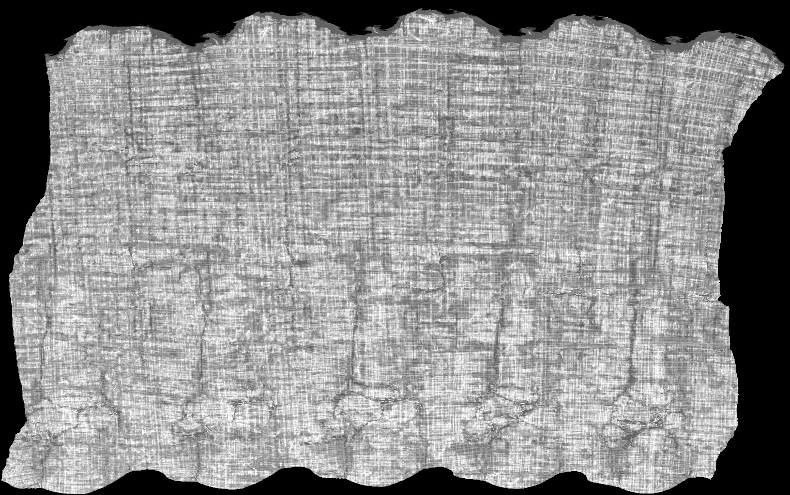

# Vesuvius Challenge — Progress Prizes

> 헤르쿨라네움 탄화 파피루스 두루마리를 CT 스캔 + ML/CV로 판독하는 오픈 챌린지.
> **우리 진입 트랙 = Progress Prizes (월간 롤링, $1k~$20k).** 리더보드 대회 아님 — **오픈소스 기여물의 유용성·채택·문서화**로 심사.

**검증일: 2026-07-19** (scrollprize.org 공식 페이지 실측). 상세 근거는 `docs/` 참조.

---

## 30초 오리엔테이션

- **주최**: Vesuvius Challenge (Nat Friedman 등). 사이트 https://scrollprize.org
- **왜 우리한테 맞나**: 롤링/월간이라 **하드마감이 파이프라인을 안 건드림**(9월 병목 회피) + CV·RTX5090·시각형 산출물(잉크 예측 이미지) 정합. trace-the-ace와 스택 겹침.
- **진입 과제 1픽 = Ink Detection** ("다운로드→첫 예측까지 주말 하나"가 공식 표현). 잉크 라벨된 표면볼륨(surface volume, TIFF 레이어 스택) → 세그멘테이션 모델 → 잉크 확률맵.
- **상금 티어(월간)**: Papyrus $1k / Sestertius $2.5k / Denarius $10k / Gold Aureus $20k. "이달의 최고 제출 $20k" 매월 보장.
- **제출**: Google Form 1건. 마감 롤링(다음 라운드 = **7/31 23:59 PT**, 그 다음 8/31). 우리 현실 타깃 = **8월 라운드**.
- **라이선스**: 수상 시 **permissive 라이선스로 오픈소스화 필수**(제출 시점엔 비공개 OK, 수상 수락 시 공개). MIT면 충분. → 우리는 원래 오픈소스라 부담 0.

> ⚠️ **이건 metric 리더보드가 아님.** 심사 3축 = ①**조기 공개**(먼저 풀린 툴이 실제로 쓰임) ②**커뮤니티 채택**(질문·버그리포트·기능요청 등 사용 신호) ③**문서화**(워크스루·이미지·튜토리얼). Kaggle/DrivenData식 "점수만 높이면 됨"과 게임이 다름. `docs/05_strategy.md` 필독.

---

## 결과 (2026-07-21) — 파이프라인 로컬 완주 ✅

네이티브 Windows + RTX 5090에서 공식 `ScrollPrize/villa` 잉크 검출 파이프라인을
**다운로드 → 학습(20k iter, ~1h31m) → 추론**까지 완주. 첫 예측물에 **그리스 대문자가
또렷이 판독**됨.

| 원본 CT 표면 (입력) | 잉크 검출 (출력) |
| :--: | :--: |
|  |  |

세그먼트 `w00_20231016151002` (PHercParis4). 재현·함정·명령 전부:
**[docs/08_windows_reproduction.md](docs/08_windows_reproduction.md)**.

## 우리가 얹은 "한 겹" (제출 대상)

점수 리더보드가 아니라 **유용성·채택·문서화**로 심사되는 트랙이라, 재현 위에 남이 바로
쓸 기여를 얹음:

1. **[`tools/ink_viz.py`](tools/ink_viz.py)** — 예측 TIFF(700MB, 뷰어로 열면 새까맣게 보임)를
   판독 가능한 이미지로 바꾸는 재사용 CLI: `stats` / `preview` / `surface` / `overlay`
   (원본 CT 위 잉크 오버레이). 사용법 [tools/README.md](tools/README.md).
2. **[Windows 재현 워크스루](docs/08_windows_reproduction.md)** — 공식 튜토리얼에 없는
   실측 함정 7종을 문서화(실 데이터 ~86GB, 추론 `--no-compile`/Triton, 5090 cu128,
   `merge-ink-pipelines` 브랜치 등).

## 빠른 시작 (재현)

```
1. docs/08_windows_reproduction.md 를 따라간다 (자기완결 워크스루).
   요약: villa 클론 → uv sync(cu128) → hf buckets sync(~86GB)
        → train(20k) → infer(--no-compile) → tools/ink_viz.py 로 시각화
2. 그 위에 개선/툴/문서 한 겹 → Progress Prize 제출 (docs/03_submission.md)
```

> ⚠️ 옛 `src/`(InkUNet·`inklabels.png`·번호 TIFF)는 **죽은 2023 Kaggle 포맷** 스캐폴드다.
> 현재 파이프라인은 zarr + villa `koine_machines`(위 워크스루). `src/`는 참고용으로만 남겨둠.

## 폴더 구조

```
vesuvius-challenge/
├── README.md            ← 지금 이 파일
├── CLAUDE.md            ← 새 세션 부팅용 (상태·컨벤션·다음 액션)
├── todo.md              ← Week0 체크리스트
├── requirements.txt     ← 시스템 Python 3.10 + cu128
├── docs/                ← 01~07 오리엔테이션 + 08 Windows 재현 워크스루
│   └── images/          ← before/after 산출 이미지
├── tools/               ← ink_viz.py (예측 TIFF 시각화 CLI) + README
├── src/                 ← ⚠️ 죽은 2023 Kaggle 포맷 스캐폴드 (참고용)
└── submission/          ← 제출 산출물 패키지 (이미지 + writeup)
```

> 실제 학습/추론 코드는 `external/villa`(gitignore, 공식 파이프라인)에서 돈다.
> 데이터·체크포인트·TIFF는 커밋 안 함(.gitignore).

## 상태

- [x] docs 오리엔테이션 (공식 검증 2026-07-19)
- [x] **데이터 다운로드 + 파이프라인 재현 완주** (2026-07-21, 첫 예측물 그리스어 판독)
- [x] **기여 한 겹**: `ink_viz` 시각화 툴 + Windows 재현 워크스루
- [ ] 첫 Progress Prize 제출 (타깃 8월 라운드, 스트레치 7/31)
- [ ] github khj1222/vesuvius-challenge 푸시 (public)
