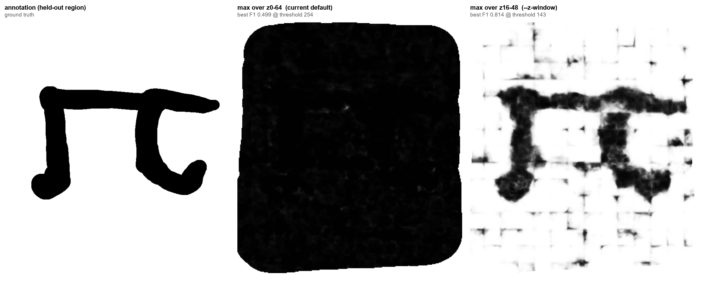

# Vesuvius Challenge — Progress Prizes

> An open challenge to read the carbonised Herculaneum papyrus scrolls from CT
> scans using ML and CV.
> **Our track is the Progress Prizes** — monthly, rolling, $500 to $20,000. Not
> a leaderboard: submissions are judged on how **useful, adopted and documented**
> the open-source contribution is.

This repository is one contributor's working record: a full local reproduction
of the official ink-detection pipeline, plus the tools, measurements and
upstream patches built on top of it. Everything here is MIT-licensed.

**A July 2026 Progress Prize was awarded to the held-out validation harness in
this repository.**

---

## 30-second orientation

- **Organiser**: Vesuvius Challenge, https://scrollprize.org
- **Entry task**: ink detection — an ink-labelled surface volume goes in, a
  segmentation model comes out, and the output is an ink probability map. The
  official framing is "one weekend from download to first prediction".
- **Prize tiers (monthly)**: $500 / $1,000 (Papyrus) / $2,500 (Sestertius) /
  $5,000 / $10,000 (Denarius) / $20,000 (Gold Aureus), with "best submission of
  the month, $20,000" guaranteed every month.
- **Submission**: one Google Form per round, linked from
  https://scrollprize.org/prizes. Note that **the form URL is specific to the
  round and the previous one closes**, so fetch it fresh each month.
- **Licence**: winning requires the method to be open-sourced permissively. This
  repository already is.

> This is **not a metric leaderboard**. The stated judging criteria are: released
> early, actually gets used, improves results on real data, fixes bugs in tools
> people rely on, reveals actionable information, and is well documented. See
> `docs/05_strategy.md`.

---

## Reproduction (2026-07-21)

The official `ScrollPrize/villa` ink-detection pipeline runs end to end on
native Windows with an RTX 5090 — download, training (20k iterations, ~1h31m),
inference. Greek capitals are legible in the first prediction.

| raw CT surface (input) | ink detection (output) |
| :--: | :--: |
|  |  |

Segment `w00_20231016151002` (PHercParis4). Every command, and the seven traps
that are not in the official tutorial:
**[docs/08_windows_reproduction.md](docs/08_windows_reproduction.md)**.

---

## What this repository adds

### 1. A held-out validation harness — [docs/09](docs/09_validation_harness.md)

Following the official tutorial trains with **zero validation data**: the
published segments carry no `_validation_mask`, so `val_every` iterates an empty
loop and the DRD and pseudo-F-measure metrics implemented in the repository
never run. Nobody could answer "did this change help?" with a number.

Four tools close that:
[`make_validation_mask.py`](tools/make_validation_mask.py) (deterministic
held-out splits taken by whole annotated region) ·
[`eval_validation.py`](tools/eval_validation.py) (threshold sweep, DRD/pFM, and
a per-region breakdown) · [`sweep_checkpoints.py`](tools/sweep_checkpoints.py)
(a curve over checkpoints) · [`run_cv_folds.py`](tools/run_cv_folds.py)
(unattended k-fold).

On our segment this took validation patches from **0 to 1,337**. Three-fold
cross-validation then established the two numbers everything else here is
measured against: **improvements below ~0.03 F1 are noise**, and **the last
checkpoint is not the best one** (two of three runs peak at 17k of 20k).

*This is the contribution that won the July 2026 Progress Prize, announced as
["an update to the ink tutorial that includes proper validation
data"](https://scrollprize.substack.com/p/335k-awarded-in-july).*

### 2. [`tools/ink_viz.py`](tools/ink_viz.py)

A prediction TIFF is 700 MB and looks black in a normal viewer. This turns one
into something legible: `stats` / `preview` / `surface` / `overlay` (ink drawn
over the raw CT). Usage in [tools/README.md](tools/README.md).

### 3. Where in z does the model find ink? — [docs/10](docs/10_depth_localization.md)

Ink annotation exists on **one slice of 65**, and depth is manufactured just
before training ([villa #192](https://github.com/ScrollPrize/villa/issues/192)).
So where does the evidence actually come from?
[`depth_profile.py`](tools/depth_profile.py) asks the model directly, by erasing
z bands (necessity) and by keeping only one (sufficiency);
[`depth_contrast.py`](tools/depth_contrast.py) asks the **raw CT with no model
involved**, measuring per-z ink-versus-background AUC — because asking only a
trained model is circular. The two independent measurements agree on
**z ~16-36 of 64**, and single-voxel intensity barely separates ink at all
(AUC <= 0.55).

### 4. Measured 3D ink labels — [docs/11](docs/11_measured_3d_labels.md)

The published annotation is **one slice at z=32**, and downstream it is
projected to a **fixed half-thickness of 1.0 voxel**.
[`make_3d_labels.py`](tools/make_3d_labels.py) replaces that constant with a
measurement: the centroid of each 64 px cell's occlusion profile, a median
filter over the cell grid, then interpolation to full resolution. The result is
`_inklabels3d.zarr` on the same grid and chunking as the label pyramid — 8
voxels thick, per-region centres from z 29.3 to 40.3. Per-pixel and argmax
estimators failed QC, and that record is in the document too.

### 5. Training on depth labels, and a three-arm comparison — [docs/12](docs/12_depth_training.md)

The 3D labels **could not be used**: the flat training loop folds z with
`amax(dim=2)` immediately before the loss, so a depth-resolved label and a plane
label are byte-identical as targets. That is part of why #192 sat open for 15
months. A `flat_depth_targets` gate computes the loss volume-to-volume, and a
`--z-window` inference flag reduces the prediction back to the usual 2D surface
map — so one harness measures every arm with the same ruler.
[`make_label_version.py`](tools/make_label_version.py) packages the three labels
as villa **label versions** (`_vN`): plane, constant band, measured band.

**Result (3 arms x 3 folds, 16 GPU hours).** Only the label differs; folds,
seed, config and schedule are identical.

| arm | band | 3-fold mean F1 | spread |
|---|---|---|---|
| v3 constant | 8 voxels, fixed | **0.8478** | 0.0076 |
| v2 plane | 1 voxel | 0.8441 | 0.0308 |
| v4 measured | 8 voxels, moving per pixel | **0.8098** | 0.0195 |

**The measured band comes last on all three folds** (-0.038 against the constant
band, above the 0.03 noise floor). But **v2 ~ v3**, so **thickness is not the
variable** — one voxel or eight scores the same, and the loss comes from moving
the band *per pixel*. The constant band reproduces the July 2D baseline
(0.8472), so depth-resolved targets are harmless in themselves. Circularity ran
in the measured band's favour — it was read out of a model trained on the
depthless annotation — and it still lost.

**So #192's premise is not supported on this segment.** The claim stops at "a
band built this way does not beat a fixed one", not "#192 is wrong".

A trap worth knowing: a depth-target model **must be reduced over the supervised
z column only**. Folding the whole volume with max drags in the unsupervised
range, where ink and background both saturate at 0.6-0.93, and the same
checkpoint collapses from **F1 0.80 to 0.53**. The symptom is a best threshold
pinned at 254.

| reduction | held-out pi (fold 1, step 17000) |
| :--: | :--: |
| whole z0-64 (the default) -> **F1 0.499** · z16-48 (`--z-window`) -> **F1 0.814** |  |

**Two robustness checks** ([docs/12](docs/12_depth_training.md), final
sections): all six runs extended to 30k steps by full-state resume held the gap
at **0.036**, so the schedule was not cut short; and repeating the entire
pipeline on a second segment, `w02_20231031143852`, reproduced the 2D baseline
to within 0.001 (0.8235 against w00's 0.8232) while the gap **widened to +0.098
with a total ordering** — the best measured fold (0.7905) below the worst
constant fold (0.8133).

### 6. First numbers for the released ink_9um models — [docs/14](docs/14_ink9um_scorecard.md)

The August 2026 `ink_9um` release ships checkpoints with **no performance
numbers on the model card**. Scoring all 14 of them on the three segments that
ship a validation mask gives an honest ceiling of **F1 0.74-0.77**, against
0.98+ on their own training pixels — a memorisation gap of 0.22 to 0.45. No step
is best everywhere, and two released seeds differ by 0.22 F1 at step 75k on the
same held-out region.

### 7. Cross-scroll generalisation, measured — [docs/15](docs/15_loso_cross_scroll.md)

The first systematic numbers for open problem #7. The public recipe was
retrained three times, each with one scroll fully removed, and scored on that
scroll's entire annotation. Four parts:

- **Measurement** — the signal that survives a scroll boundary is **+0.06 to
  +0.17 F1 over the trivial "everything is ink" baseline**, across three
  scrolls. Honest-to-honest, that is a drop of 0.17 to 0.26 from a model's
  performance on its own scroll.
- **Nature** — it is **bias, not variance**: seeds differ by 0.01-0.03 where
  in-scroll seeds differ by 0.22, and ensembling two seeds recovers only
  +0.005 to +0.009.
- **Cost to repair** — **one annotated segment on the target scroll plus about 7
  GPU minutes** closes 82% of the gap (0.496 to 0.822 on seven segments the
  fine-tune never saw), saturating at 2,500 steps. **On a second scroll the same
  recipe closes 24%** ([docs/18](docs/18_uda_design.md)): the saturation point
  replicates, the magnitude does not.
- **A First Letters playbook**, with a measured expected value for each step.
- **The price of that repair** — rebuilding the fine-tune on nested subsets of one
  segment's annotation: **half the annotation keeps 89% of the benefit for 0.033
  F1**, a fifth keeps 71%, an eighth 56%. So "annotate one segment" now carries a
  number, and the number says annotate half of one.

Two appendices record hypotheses put to the test rather than defended. One is ours,
**rejected** by a **pre-registered** follow-up arm: the aligned representation's
advantage is not domain match but representation quality, and the retraction was
posted upstream. The other is a reviewer's explanation of *why* — checked by reading
the published pyramids, which turn out to be mean-built and to leave z alone, so one
aligned voxel averages **64 acquired voxels** where a native one is a single
acquisition.

### 8. Running the render path on an unseen scroll — [docs/16](docs/16_first_letters_render.md)

The full path from an S3 mesh to a prediction on PHerc1447, with every stage
timed. **It works, and it reads nothing**, exactly as docs/15 predicted. The
negative result matters because it shows the playbook's scouting step does not
achieve its purpose: the prediction cannot say where to annotate, so
unsupervised domain adaptation has to come first.

### 9. Auditing the corpus's own held-out masks — [docs/17](docs/17_holdout_audit.md)

Three of ink_9um's 29 segments ship a validation mask, and every honest number
on this corpus rests on them. All three are **cut through annotated regions**
rather than taken whole; on `pherc0139-w016` no leak-free held-out subset exists
at all, because 99.1% of its held-out pixels sit within two training patches and
the remainder contains no ink.

Whether that adjacency pays needed no new training — the released checkpoints
trained on those segments and our leave-one-scroll-out arms never saw them, so
scoring both over the same distance strata separates leakage from difficulty.
The control is nearly flat while the trained model gains **+0.14 and +0.07 F1
more** on the held-out pixels nearest its training pixels.
[`audit_holdout_masks.py`](tools/audit_holdout_masks.py) does this for any
segment.

### 10. Can a model adapt to a scroll nobody has labelled? — [docs/18](docs/18_uda_design.md)

docs/16 ends at a wall: direct transfer reads nothing, and the prediction cannot
say where to annotate, so unsupervised adaptation has to come first. This is that
question, run as three arms whose **design, prediction and decision rule were each
committed publicly before the run**.

| arm | predicted | measured | verdict |
|---|---|---|---|
| **A** spectrum matching | 0–20% of the gap | +0.005 F1, median 9.1% | no effect |
| **B** entropy minimisation (TENT) | 10–40% | **−0.041 F1**, 0 of 14 cells, AUC 0.66 → 0.48 | **harms**; prediction refuted |
| **C** pseudo-label self-training | −10% to +15% | **+0.030 F1**, 14 of 14 cells, **+9.5%** | improves, at the noise floor |
| **D** the same, transductive | +5% to +30% | **+0.046 F1**, 14 of 14 cells, **+14.3%** | improves, past the floor |

**All four rows are Paris4.** Replicated on 1667 (2026-08-31, 90 more cells), arm C
stays inside the noise floor at every step and **arm D is negative at every step** —
so the label-free result does not cross between scrolls, and neither does the size
of what an annotation buys.

Two things are worth taking away from it. **Arm B's own objective is
anti-correlated with quality** — the entropy it minimises falls monotonically the
whole way down while AUC falls to below chance, so no label-free early stop built
on that objective could have caught it; the only correct choice was not to start.
And **arms C and D price the annotation**: with the base checkpoint, the recipe
and the step count held fixed, a human annotation on one segment buys +0.320 F1 on
seven segments, while the model's own confident predictions buy +0.030 on a
different segment and +0.046 on the sheets it is about to read. **The annotation
is worth about seven times the best label-free method** — and that label-free 14%
is what you can have on a scroll nobody has annotated yet.

One of the four predictions was wrong, in the direction not considered. That is
what committing them in advance was for.

---

## Upstream contributions to ScrollPrize/villa

- **[PR #1249](https://github.com/ScrollPrize/villa/pull/1249)** — community
  projects listing. **Merged 2026-07-31**, putting the harness on
  scrollprize.org's community tools list.
- **[PR #1234](https://github.com/ScrollPrize/villa/pull/1234)** — make
  `create_label_zarrs` stream striped TIFFs. The existing code builds the whole
  pyramid in memory and dies allocating 25 GiB (only tiled TIFFs streamed).
  Found while building masks for the harness; verified byte-identical to the
  tiled path across six levels and on a real 32249x51380 image. **Merged
  2026-08-14** (review round: derive the 2D pyramid in memory, 114.5s -> 66.5s).
- **[PR #1535](https://github.com/ScrollPrize/villa/pull/1535)** —
  `flat_depth_targets`, opening up label-depth experiments that the flat loop
  otherwise makes impossible, plus `--z-window` at inference. Awaiting review.
  (Its predecessor [#1434](https://github.com/ScrollPrize/villa/pull/1434) was
  closed on 2026-08-18 asking for `CONTRIBUTING.md` compliance and for the
  never-measured `mean` reduction to be dropped; both were addressed.)
- **[PR #1608](https://github.com/ScrollPrize/villa/pull/1608)** —
  `make_holdout_config.py`. The published ink_9um recipe does not run as
  shipped: its `datasets` field holds a single `/path/to/` placeholder while the
  29 representations live in a separate contract file. This joins the two and
  adds `--exclude-scroll` / `--exclude-segment`. Under review, and the review
  found a real crash, since fixed.
- **[Issue #1231](https://github.com/ScrollPrize/villa/issues/1231)** — asking
  whether the missing `_validation_mask` on published segments is intended.
  Triaged and assigned; no reply yet.
- **[Issue #192](https://github.com/ScrollPrize/villa/issues/192)** — the
  three-arm result reported on the original issue.
  [`export_depth_anchors.py`](tools/export_depth_anchors.py) exported the
  measured band as scroll-coordinate anchors (7,005 cells with normals, with the
  unverified assumptions spelled out in a sidecar), and a third party scored
  them against an independent 1.129 um scan: the band's centre sits a median 2.0
  voxels from the independently observed surface.
- **[Issue #1611](https://github.com/ScrollPrize/villa/issues/1611)** — the
  renderer waits forever when remote streaming stalls, with a workaround and the
  evidence that it finishes the job.

---

## Quick start

```
1. Follow docs/08_windows_reproduction.md (a self-contained walkthrough).
   In short: clone villa -> uv sync (cu128) -> hf buckets sync (~86 GB)
             -> train (20k) -> infer (--no-compile) -> visualise with tools/ink_viz.py
2. Add your own layer on top, then submit (docs/03_submission.md).
```

> The old `src/` tree (InkUNet, `inklabels.png`, numbered TIFFs) targets the
> **dead 2023 Kaggle format**. The current pipeline is zarr plus villa
> `koine_machines`, as in the walkthrough above; `src/` is kept for reference
> only.

## Repository layout

```
vesuvius-challenge/
├── README.md            <- this file
├── CLAUDE.md            <- session bootstrap (state, conventions, next actions)
├── requirements.txt     <- system Python 3.10 + cu128
├── docs/                <- 01-07 orientation · 08 reproduction · 09 validation harness
│                           10 depth localisation · 11 3D labels · 12 depth training
│                           13 September scouting · 14 ink_9um scorecard
│                           15 cross-scroll LOSO · 16 First Letters render
│                           17 held-out mask audit
│   └── images/          <- before/after figures
├── configs/             <- training configs where validation actually runs
├── tools/               <- ink_viz, the validation harness, depth measurement,
│                           3D labels, anchor export, held-out audit, label budgets
├── src/                 <- dead 2023 Kaggle-format scaffold (reference only)
└── submission/          <- submission packages and upstream drafts
```

> Training and inference themselves run in `external/villa` (gitignored, the
> official pipeline). Data, checkpoints and TIFFs are not committed.

## Status

- [x] Orientation docs (verified against scrollprize.org, 2026-07-19)
- [x] **Pipeline reproduced end to end** (2026-07-21) — Greek legible in the first prediction
- [x] **Held-out validation harness** (2026-07-25) — validation patches 0 -> 1,337
- [x] **July round submitted** (2026-07-26) -> **Progress Prize, $1,000 Papyrus**
- [x] **#192 3D-label experiment** (2026-08-09) — 3 arms x 3 folds, a negative result
- [x] **Robustness** (2026-08-15/16) — 30k extension holds the gap; `w02` replicates it wider
- [x] **Two upstream PRs merged** — #1249 (2026-07-31), #1234 (2026-08-14)
- [x] **September track measured** (2026-08-22/26) — ink_9um scorecard, three LOSO arms,
      fine-tune cost curve, the render path on an unseen scroll
- [x] **August round submitted** (2026-08-29)
- [x] **September track measured** (2026-08-29/30) — held-out mask audit
      ([docs/17](docs/17_holdout_audit.md)), the label-efficiency curve, and the
      pre-registered adaptation ladder ([docs/18](docs/18_uda_design.md))
- [ ] September round — submission (deadline 2026-09-30)
