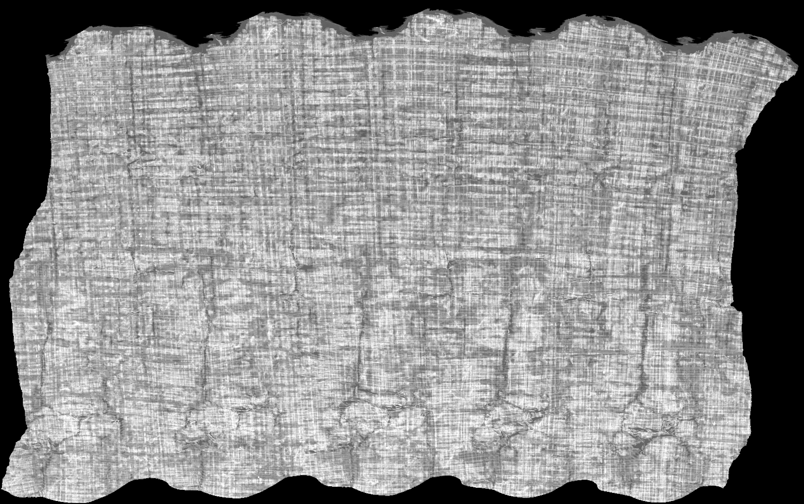

# Vesuvius Challenge — Progress Prizes

> 헤르쿨라네움 탄화 파피루스 두루마리를 CT 스캔 + ML/CV로 판독하는 오픈 챌린지.
> **우리 진입 트랙 = Progress Prizes (월간 롤링, $1k~$20k).** 리더보드 대회 아님 — **오픈소스 기여물의 유용성·채택·문서화**로 심사.

**검증일: 2026-07-19** (scrollprize.org 공식 페이지 실측). 상세 근거는 `docs/` 참조.

---

## 30초 오리엔테이션

- **주최**: Vesuvius Challenge (Nat Friedman 등). 사이트 https://scrollprize.org
- **왜 우리한테 맞나**: 롤링/월간이라 **하드마감이 파이프라인을 안 건드림**(9월 병목 회피) + CV·RTX5090·시각형 산출물(잉크 예측 이미지) 정합. trace-the-ace와 스택 겹침.
- **진입 과제 1픽 = Ink Detection** ("다운로드→첫 예측까지 주말 하나"가 공식 표현). 잉크 라벨된 표면볼륨(surface volume, TIFF 레이어 스택) → 세그멘테이션 모델 → 잉크 확률맵.
- **상금 티어(월간)**: Papyrus $1k / Sestertius $2.5k / Denarius $10k / Gold Aureus $20k. "이달의 최고 제출 $20k" 매월 보장.
- **제출**: Google Form 1건. 마감 롤링. **7월 라운드 제출(7/26) → 수상(8/4 통보).** 다음 = **8/31 23:59 PT**.
- **라이선스**: 수상 시 **permissive 라이선스로 오픈소스화 필수**(제출 시점엔 비공개 OK, 수상 수락 시 공개). MIT면 충분. → 우리는 원래 오픈소스라 부담 0.

> ⚠️ **이건 metric 리더보드가 아님.** 심사 3축 = ①**조기 공개**(먼저 풀린 툴이 실제로 쓰임) ②**커뮤니티 채택**(질문·버그리포트·기능요청 등 사용 신호) ③**문서화**(워크스루·이미지·튜토리얼). Kaggle/DrivenData식 "점수만 높이면 됨"과 게임이 다름. `docs/05_strategy.md` 필독.

---

## 결과 (2026-07-21) — 파이프라인 로컬 완주 ✅

네이티브 Windows + RTX 5090에서 공식 `ScrollPrize/villa` 잉크 검출 파이프라인을
**다운로드 → 학습(20k iter, ~1h31m) → 추론**까지 완주. 첫 예측물에 **그리스 대문자가
또렷이 판독**됨.

| 원본 CT 표면 (입력) | 잉크 검출 (출력) |
| :--: | :--: |
|  |  |

세그먼트 `w00_20231016151002` (PHercParis4). 재현·함정·명령 전부:
**[docs/08_windows_reproduction.md](docs/08_windows_reproduction.md)**.

## 우리가 얹은 "한 겹" (제출 대상)

점수 리더보드가 아니라 **유용성·채택·문서화**로 심사되는 트랙이라, 재현 위에 남이 바로
쓸 기여를 얹음:

1. **[held-out 검증 하네스](docs/09_validation_harness.md)** — 공식 튜토리얼대로 학습하면
   **검증 세트가 0개**다(배포 세그먼트에 `_validation_mask`가 없음). `val_every`는 빈 루프를
   돌고, 저장소에 구현된 DRD·pseudo-F-measure는 한 번도 실행되지 않는다. 즉 "이 변경이
   나아졌나?"에 아무도 수치로 답할 수 없는 상태. 이걸 메우는 툴 4종:
   [`make_validation_mask.py`](tools/make_validation_mask.py) (주석 영역 단위 결정론적 held-out) ·
   [`eval_validation.py`](tools/eval_validation.py) (임계값 스윕 + DRD/pFM + 영역별 분해) ·
   [`sweep_checkpoints.py`](tools/sweep_checkpoints.py) (체크포인트별 곡선) ·
   [`run_cv_folds.py`](tools/run_cv_folds.py) (k-fold 무인 실행).
   → 우리 세그먼트에서 **검증 패치 0 → 1,337개**. 3-fold 교차검증까지 돌려
   **"~0.03 F1 미만 개선은 노이즈"**라는 기준선과 **"마지막 체크포인트가 최적이 아니다"**(3런 중 2런이 17k에서 정점)를 실측.
2. **[`tools/ink_viz.py`](tools/ink_viz.py)** — 예측 TIFF(700MB, 뷰어로 열면 새까맣게 보임)를
   판독 가능한 이미지로 바꾸는 재사용 CLI: `stats` / `preview` / `surface` / `overlay`
   (원본 CT 위 잉크 오버레이). 사용법 [tools/README.md](tools/README.md).
3. **[Windows 재현 워크스루](docs/08_windows_reproduction.md)** — 공식 튜토리얼에 없는
   실측 함정 7종을 문서화(실 데이터 ~86GB, 추론 `--no-compile`/Triton, 5090 cu128,
   `merge-ink-pipelines` 브랜치 등).
4. **[깊이 국소화 측정](docs/10_depth_localization.md)** — 잉크 주석은 65층 중 한 장에만
   있고, 깊이는 학습 직전에 만들어진다([villa #192](https://github.com/ScrollPrize/villa/issues/192)).
   그럼 모델은 z축 어디에서 잉크 근거를 얻는가? [`depth_profile.py`](tools/depth_profile.py)는 z밴드를
   지우거나(필요성) 그것만 남겨(충분성) 모델에 직접 묻고,
   [`depth_contrast.py`](tools/depth_contrast.py)는 **모델 없이** 원본 CT의 z별 잉크-배경
   AUC를 잰다 — 학습된 모델로만 물으면 순환논증이 되기 때문. 두 측정이 독립적으로
   **z≈16–36**(64층 중)을 가리켰고, 단일 복셀 밝기로는 잉크가 거의 구분되지 않는다(AUC ≤ 0.55).
5. **[측정된 3D 잉크 라벨](docs/11_measured_3d_labels.md)** — 배포된 주석은 65층 중
   **z=32 한 장**뿐이고, 깊이는 하류에서 **고정 반두께 1.0복셀** 투영으로 만들어진다.
   [`make_3d_labels.py`](tools/make_3d_labels.py)는 그 두께와 중심을 측정값으로 바꾼다:
   64px 셀별 occlusion 프로파일의 무게중심 → 셀 격자 중앙값 필터 → 전해상도 보간.
   결과는 라벨 피라미드와 같은 그리드·청크의 `_inklabels3d.zarr`(8복셀 두께, 영역별
   중심 z 29.3–40.3). 픽셀 단위·argmax 추정은 QC에서 탈락했고 그 기록도 문서에 남겼다.
6. **[깊이 라벨로 학습하기 + 3 arm 비교](docs/12_depth_training.md)** — 만든 3D 라벨을
   **쓸 수가 없었다**: flat 학습 루프가 손실 직전에 `amax(dim=2)`로 z를 접어, 3D 라벨과 평면
   라벨이 타깃 단계에서 바이트 동일해진다. #192가 15개월간 방치된 이유의 일부다.
   `flat_depth_targets` 게이트로 볼륨 대 볼륨 손실을 넣고, 추론에 `--z-reduce`/`--z-window`를
   더해 예측을 기존과 같은 2D 표면맵으로 환원한다 — 그래야 하네스 하나로 모든 arm을 같은 자로
   잰다. [`make_label_version.py`](tools/make_label_version.py)가 세 라벨을 villa가 이미 아는
   **label version**(`_vN`)으로 패키징한다: 평면 / 고정 밴드 / 측정된 밴드.

   **결과 (3 arm × 3 fold, GPU 16h):** 라벨만 다르고 fold·시드·config·스케줄은 전부 동일.

   | arm | 밴드 | 3-fold 평균 F1 | spread |
   |---|---|---|---|
   | v3 constant | 8복셀 고정 | **0.8478** | 0.0076 |
   | v2 plane | 1복셀 | 0.8441 | 0.0308 |
   | v4 measured | 8복셀, 픽셀마다 이동 | **0.8098** | 0.0195 |

   **측정된 밴드가 3 fold 전부 꼴찌**다(고정 밴드 대비 −0.038 > 노이즈 기준선 0.03).
   그런데 **v2 ≈ v3**이므로 **두께는 변수가 아니다** — 1복셀이든 8복셀이든 같은 점수고,
   손해는 밴드를 **픽셀마다 움직일 때** 생긴다. 고정 밴드는 7월 2D 베이스라인(0.8472)을
   그대로 재현하므로 깊이 타깃 자체도 무해하다. 순환성 우려는 오히려 측정 밴드에 유리하게
   작용했어야 하는데(측정값을 깊이 없는 라벨로 학습한 모델에서 뽑았다) 그래도 졌다.
   → **#192의 전제가 이 세그먼트에서 지지되지 않는다.** "#192가 틀렸다"가 아니라
   "이 경로로 만든 밴드가 고정 밴드를 못 이긴다"까지가 주장 범위.

   ⚠️ 부수 발견: 깊이 타깃 모델은 **감독한 z 기둥으로만 환원해야 한다.** 볼륨 전체를 max로
   접으면 무감독 구간(잉크·배경 모두 0.6~0.93으로 포화)이 딸려 올라와 같은 체크포인트가
   **F1 0.80 → 0.53**으로 무너진다. 증상은 best threshold가 254에 못박히는 것.

### 업스트림(ScrollPrize/villa) 기여

- **[PR #1234](https://github.com/ScrollPrize/villa/pull/1234)** — `create_label_zarrs`가 striped
  TIFF를 스트리밍하도록 수정. 기존 코드는 피라미드를 메모리에 통째로 올려 25GiB를 할당하다
  죽는다(tiled TIFF만 스트리밍됨). 하네스용 마스크를 만들다 발견했고, 기존 tiled 경로와
  6레벨 바이트 동일 + 실제 32249×51380 striped 이미지 83초 변환으로 검증.
- **[Issue #1231](https://github.com/ScrollPrize/villa/issues/1231)** — 배포 세그먼트에
  `_validation_mask`가 없는 것이 의도인지 메인테이너 문의.
- **[PR #1249](https://github.com/ScrollPrize/villa/pull/1249)** — 커뮤니티 프로젝트 목록 등재.
  **2026-07-31 머지됨** — 하네스가 scrollprize.org 커뮤니티 툴 목록에 등재.

## 빠른 시작 (재현)

```
1. docs/08_windows_reproduction.md 를 따라간다 (자기완결 워크스루).
   요약: villa 클론 → uv sync(cu128) → hf buckets sync(~86GB)
        → train(20k) → infer(--no-compile) → tools/ink_viz.py 로 시각화
2. 그 위에 개선/툴/문서 한 겹 → Progress Prize 제출 (docs/03_submission.md)
```

> ⚠️ 옛 `src/`(InkUNet·`inklabels.png`·번호 TIFF)는 **죽은 2023 Kaggle 포맷** 스캐폴드다.
> 현재 파이프라인은 zarr + villa `koine_machines`(위 워크스루). `src/`는 참고용으로만 남겨둠.

## 폴더 구조

```
vesuvius-challenge/
├── README.md            ← 지금 이 파일
├── CLAUDE.md            ← 새 세션 부팅용 (상태·컨벤션·다음 액션)
├── todo.md              ← Week0 체크리스트
├── requirements.txt     ← 시스템 Python 3.10 + cu128
├── docs/                ← 01~07 오리엔테이션 + 08 재현 + 09 검증 하네스 + 10 깊이 국소화
│                          + 11 3D 라벨 + 12 깊이 학습·3 arm 비교
│   └── images/          ← before/after 산출 이미지 + 검증 split 그림
├── configs/             ← 검증이 실제로 도는 학습 config
├── tools/               ← ink_viz + 검증 하네스 3종 CLI + README
├── src/                 ← ⚠️ 죽은 2023 Kaggle 포맷 스캐폴드 (참고용)
└── submission/          ← 제출 산출물 패키지 (이미지 + writeup)
```

> 실제 학습/추론 코드는 `external/villa`(gitignore, 공식 파이프라인)에서 돈다.
> 데이터·체크포인트·TIFF는 커밋 안 함(.gitignore).

## 상태

- [x] docs 오리엔테이션 (공식 검증 2026-07-19)
- [x] **데이터 다운로드 + 파이프라인 재현 완주** (2026-07-21, 첫 예측물 그리스어 판독)
- [x] **기여 한 겹**: `ink_viz` 시각화 툴 + Windows 재현 워크스루
- [x] **github khj1222/vesuvius-challenge 푸시 (public)** — 2026-07-21
- [x] **held-out 검증 하네스** (2026-07-25) — 검증 패치 0 → 1,337개, DRD·pFM 최초 실행
- [x] **7월 라운드 제출** (2026-07-26) → 🏆 **Progress Prize 수상** (2026-08-04 통보)
- [x] **#192 3D 라벨 실험 완료** (2026-08-09) — 3 arm × 3 fold, 음의 결과
- [ ] 8월 라운드 제출 (마감 8/31 23:59 PT)
