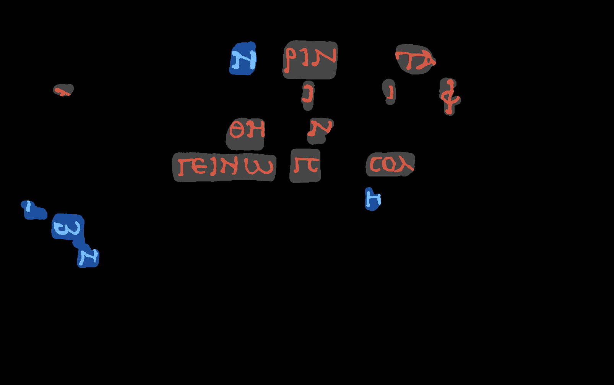
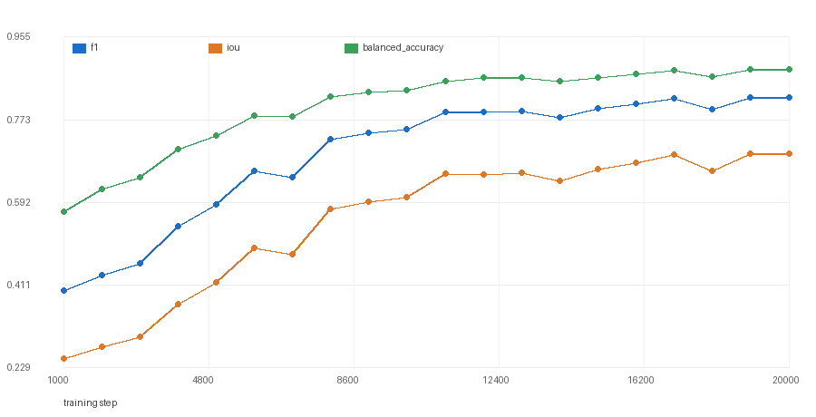
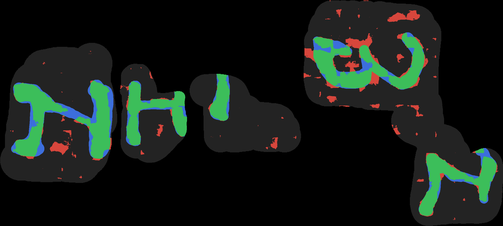

# A held-out validation harness for the ink-detection tutorial

**Status:** working, measured on `w00_20231016151002` (PHerc. Paris 4 / Scroll 1), RTX 5090, native Windows.
**Code:** [`tools/make_validation_mask.py`](../tools/make_validation_mask.py) ·
[`tools/eval_validation.py`](../tools/eval_validation.py) ·
[`tools/sweep_checkpoints.py`](../tools/sweep_checkpoints.py) ·
[`configs/ink_tutorial_val.json`](../configs/ink_tutorial_val.json)

## The gap

Follow [tutorial 5](https://scrollprize.org/tutorial5) exactly and you get a
model, a prediction, and **no way to tell whether any change you make to it is
an improvement**. Not because the pipeline lacks the machinery — because the
machinery never gets switched on.

The `koine_machines` pipeline already supports a per-segment
`<name>_validation_mask` asset:

| where | what it does |
|---|---|
| `data/patch_finding/default.py` | every patch touching the mask becomes a *validation* patch |
| `data/ink_dataset.py` | `_exclude_validation_voxels_from_training_supervision` zeroes those voxels out of the training supervision, so train/val never overlap |
| `training/train.py` | runs a validation pass every `val_every` steps and logs Confusion / BalancedAccuracy |
| `preprocessing/create_label_zarrs.py` | already knows how to convert `_validation_mask.{tif,tiff,png}` |
| `evaluation/metrics/` | implements Confusion, BalancedAccuracy, **DRD**, **pseudo-F-measure** |

But the published segment ships only `_inklabels` and `_supervision_mask`. There
is no `_validation_mask`, the tutorial never mentions validation, and nothing
generates one. The result, measured on our own tutorial run:

```
runs/ink_tutorial/flat_ink_patches_...json   is_validation: true  ->     0
                                             is_validation: false -> 2,710
runs/ink_tutorial/val_previews/              (empty)
```

`val_every: 500` fires every 500 steps into an empty loader, `val_previews/`
stays empty for the whole run, and DRD and pseudo-F-measure never execute. Every
"this augmentation helps" / "this checkpoint is better" claim built on the
tutorial is, today, unfalsifiable.

## What the segment actually looks like

Before splitting anything, it is worth knowing what supervision on these
segments *is*. It is not a continuous ribbon. On `w00_20231016151002` it is
**15 disconnected regions** — boxes drawn around annotated letters:

| | |
|---|---|
| regions | 15 |
| area share | 1.5% … 20.7% each (top-5 = 61.5%) |
| ink density | 0.114 … 0.440 per region (segment: 0.228) |
| nearest-neighbour distance | 4 of 15 regions sit **closer than one 256 px patch** to another region (104, 104, 216, 216 px) |

Two design consequences follow, and getting them wrong produces a validation set
that quietly lies:

* **Split by region, never by pixel.** Our first attempt held out a rectangular
  band — and it cut letters in half, training on the left stroke of a `Ν` and
  scoring on the right stroke a few pixels away.
* **Keep near neighbours together.** Two pairs of regions are close enough that
  a single 256×256 training patch can straddle the train/val line. Regions
  closer than `--min-gap` (default 256, the patch size) are merged into one
  indivisible group before splitting.

## What this adds

Three tools, no changes to the upstream pipeline — they produce the asset it is
already waiting for.

```bash
# 1. hold out whole annotated regions (writes <seg>_validation_mask.tif + .json spec)
uv run --project external/villa/ink-detection \
    python tools/make_validation_mask.py SEGMENT_DIR --preview split.png

# 2. convert it with the pipeline's own converter
uv run --project external/villa/ink-detection \
    python -m koine_machines.preprocessing.create_label_zarrs SEGMENT_DIR

# 3. train as usual -- validation now actually runs
uv run --directory external/villa/ink-detection \
    python -m koine_machines.training.train configs/ink_tutorial_val.json
```

On `w00_20231016151002` that turns **0 validation patches into 1,337**, with
training patches going 2,710 → 2,240:

```
runs/ink_holdout_20k/flat_ink_patches_...json   is_validation: true  -> 1,337
                                                is_validation: false -> 2,240
runs/ink_holdout_20k/val_previews/...           written every val_every steps
progress bar:  loss=0.5429, val_loss=0.7457     <- val_loss is a real number now
```



*Held-out regions in blue, training regions in gray; ink in red (train) and light
blue (held out). Whole regions move together — no letter is cut.*

## How the split is chosen

`make_validation_mask.py` labels the supervision mask's connected regions,
merges those closer than one patch, and then searches **exhaustively** over
group subsets (there are only a dozen) for the one whose held-out ink density
best matches the segment. There is no RNG — same segment, same options, same
split for everybody. On `w00_20231016151002`:

```
supervised regions: 15  ->  13 groups (merged below 256 full-res px)
held out         : single split (target 0.20)
  groups         : [1, 10, 11, 12]  (regions [2, 13, 14, 15])
  fraction       : 0.200 of supervised area
  ink density    : global 0.2283 | train 0.2283 | val 0.2283
```

Because the granularity is coarse — a held-out set is *four letters*, not a
statistical sample — the tool also offers `--folds K`, which partitions the
groups into K area-balanced folds so a claim can be checked against the spread
of K runs instead of one lucky split:

```
5-fold partition (area-balanced):
  fold 0: groups [7]           area 435,260 (29.0%)  ink 0.2140
  fold 1: groups [0]           area 256,625 (17.1%)  ink 0.1884
  fold 2: groups [12, 6, 3]    area 260,430 (17.4%)  ink 0.2785
  fold 3: groups [9, 1, 11, 5] area 269,400 (18.0%)  ink 0.2390
  fold 4: groups [8, 2, 10, 4] area 277,303 (18.5%)  ink 0.2302
```

The folds are visibly lumpy — one group alone is 29% of the supervised area.
That is a property of the data, not of the splitter, and it is exactly the sort
of thing a validation harness should show you rather than hide.

## What gets measured

`eval_validation.py` scores a prediction TIFF inside the held-out regions:

* a **threshold sweep** over the full uint8 range — precision/recall/F1/IoU at
  every threshold from two 256-bin histograms, so the whole curve costs one pass;
* confusion metrics at the chosen threshold, including the balanced accuracy
  `train.py` logs;
* **DRD** and **pseudo-F-measure**, called through the repo's own metric classes
  — as far as we can tell this is the first thing in the pipeline that runs them;
* a **per-region breakdown**, because with four held-out regions a single
  average hides which letters the model actually failed on. Both image metrics
  normalize per image, so they are computed per region rather than across a
  mostly-empty full-segment canvas.

`sweep_checkpoints.py` answers "which checkpoint should I keep?" by running each
`ckpt_*.pth` through inference restricted to the held-out regions
(`infer --mask-path` skips every block outside them — **166 blocks instead of
9,425**, ~30 s instead of 23 min), scoring it, and emitting `summary.csv` plus a
Pillow-drawn `curve.png`.

## Results on `w00_20231016151002`

A clean 20k-iteration run of the tutorial config (2,240 training / 1,337
validation patches, 1 h 38 m on an RTX 5090), every checkpoint scored on the
held-out regions:



| step | F1 | precision | recall | IoU | balanced acc | best threshold |
|---:|---:|---:|---:|---:|---:|---:|
| 1000 | 0.3992 | 0.2664 | 0.7961 | 0.2494 | 0.5726 | 144 |
| 5000 | 0.5881 | 0.5526 | 0.6284 | 0.4165 | 0.7387 | 186 |
| 10000 | 0.7526 | 0.7540 | 0.7512 | 0.6034 | 0.8392 | 149 |
| 15000 | 0.7995 | 0.8163 | 0.7833 | 0.6659 | 0.8655 | 144 |
| 17000 | 0.8213 | 0.8247 | 0.8180 | 0.6968 | 0.8832 | 126 |
| **20000** | **0.8232** | 0.8276 | 0.8188 | 0.6995 | 0.8841 | 146 |

Full table: `runs/ink_holdout_20k/validation/summary.csv`.

Two things fall out of this that were previously invisible:

* **The run is still improving at 20k.** F1 climbs from 0.40 to 0.82 and has not
  flattened; the tutorial's iteration count is a floor, not a converged setting.
  There are local dips (7k, 14k, 18k) big enough — up to 0.026 F1 — that
  comparing two configs at a single checkpoint would be unreliable.
* **The F1-optimal threshold wanders between 122 and 198** across checkpoints.
  Anyone scoring at a fixed threshold is partly measuring calibration drift, not
  quality; `eval_validation.py` sweeps instead.

### Per region, at the best checkpoint



*Held-out regions at step 20000, threshold 146. Green = hit, blue = miss,
red = false positive.*

| region | scored px | ink | F1 | precision | recall | DRD | pFM |
|---:|---:|---:|---:|---:|---:|---:|---:|
| 1 | 5,467,600 | 26.9% | 0.8204 | 0.9034 | 0.7513 | 326.3 | 0.9526 |
| 2 | 1,991,836 | 33.3% | 0.8954 | 0.9159 | 0.8759 | 226.0 | 0.9970 |
| 3 | 2,446,912 | 11.4% | 0.8721 | 0.8873 | 0.8575 | 196.5 | 0.9982 |
| 4 | 9,176,904 | 21.3% | 0.7960 | 0.7527 | 0.8447 | 337.0 | 0.9471 |

**F1 spread across four regions: 0.796 … 0.895.** That is the number to keep in
mind before believing any reported improvement: a change worth less than ~0.05 F1
on a single split is not distinguishable from which letters happened to be held
out. The picture shows why the misses cluster where they do — the model recovers
stroke cores and loses the edges.

### Leakage baseline

The checkpoint from our original tutorial run (trained before any mask existed,
so it saw the held-out regions during training) scores:

```
best F1 0.8594 @ threshold 158   precision 0.8624   recall 0.8564   IoU 0.7535
per-region F1: 0.8411 / 0.8573 / 0.8902 / 0.9073
```

versus **0.8232** for the clean run — a checkpoint that never saw those regions.
The 0.036 gap is not a pure leakage measurement (the leaky model also trained on
20% more data), but it is the right order of magnitude for what a tutorial run
would unknowingly report as its score. Without a validation mask there is no way
to even notice the difference.

## Gotchas found along the way

| # | Symptom | Cause / fix |
|---|---|---|
| 1 | `create_label_zarrs` dies with `Unable to allocate 25.1 GiB for an array with shape (65, 16125, 25690)` | It streams level 0 **only for tiled TIFFs** (`_get_tiled_tiff_metadata` → `_convert_tiled_tiff`). A striped TIFF falls back to `build_pyramid`, which materializes the whole 65-deep volume. The shipped label TIFFs are tiled 256×256; `make_validation_mask.py` writes tiled TIFFs to match. |
| 2 | New mask, but training reuses the old train/val split | The patch cache is keyed by asset **paths**, not contents (`Segment.cache_key`). Regenerating `_validation_mask.zarr` in place leaves the key unchanged, so a rerun in the same `out_dir` reloads the stale patch list. Train into a fresh `out_dir` (or delete `flat_ink_patches_*.json`). |
| 3 | `runs/` appears in your own repo instead of next to the pipeline | `out_dir` is resolved against the working directory. `uv run --project` keeps cwd where you are (good for tools taking repo-relative paths); `--directory` moves it into the pipeline (right for training). |
| 4 | Validation seems to run but only looks at a handful of patches | `num_val_batches = min(len(val_dl), config.get('val_steps', 10))` — the default caps validation at **10 batches**. `configs/ink_tutorial_val.json` sets `val_steps: 50`; use `sweep_checkpoints.py` for full-region numbers. |
| 5 | Training patch count doesn't drop by exactly the held-out fraction | `find_segment_patches` filters training patches by `patch_min_labeled_coverage` against the *raw* inklabels, before validation voxels are masked out. A patch whose ink lies entirely inside the held-out region can still qualify as a training patch — it just contributes an empty supervision map. |
| 6 | DRD looks enormous next to DIBCO-literature values | DRD normalizes by the count of non-uniform 8×8 blocks in the ground truth. On these crops the absolute number is not comparable to page-sized document benchmarks — use it to compare runs on the same regions, not against published figures. |
| 7 | `uv run --directory ...` can't find `tools/foo.py` | `--directory` changes the working directory, so relative script paths resolve against the pipeline dir. Use `--project` for the tools. |
| 8 | pseudo-F-measure raises about `cv2.ximgproc` | `PFMWeighted` needs `opencv-contrib`. It is present in the ink-detection environment, but the dependency is implicit — `eval_validation.py` reports the failure per metric instead of aborting the run. |

## Limitations

* **Four regions.** A 20% held-out split of this segment is four annotated
  regions. Per-region F1 varies by ~0.07 even on a leakage baseline, so treat
  small differences between runs as noise unless they hold across `--folds`.
* **One segment.** The held-out regions come from the *same* segment the model
  trains on, so this measures within-segment generalization, not cross-scroll
  transfer ([open problem #7](https://scrollprize.org/2026_open_problems)). It is
  the split the tutorial's single-segment setup allows.
* **Imagery is not held out, labels are.** Training patches near a held-out
  region still see its pixels; only the labels are masked. Merging near
  neighbours bounds this, but it makes these numbers a mild upper bound.
