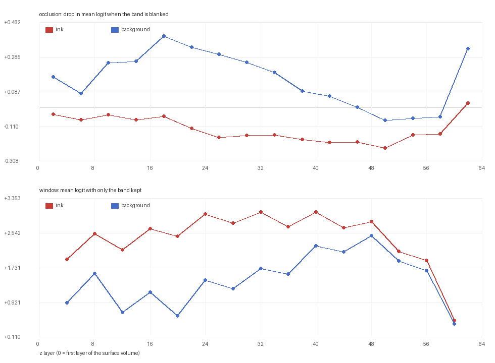
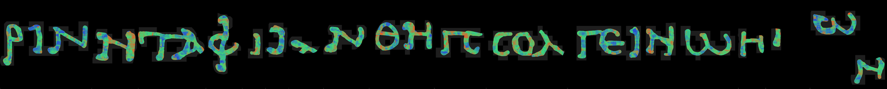
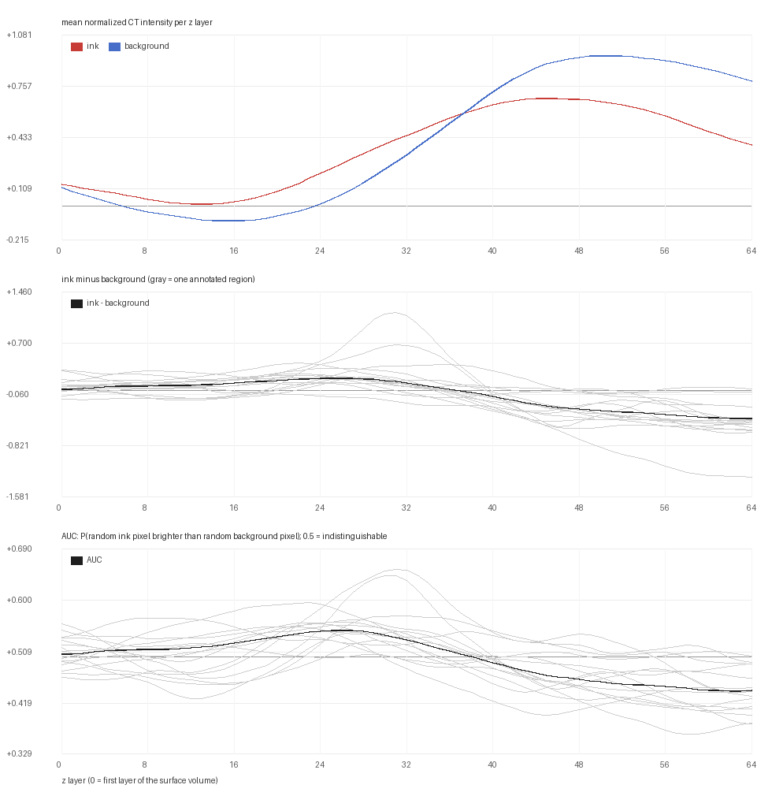

# Where along z does a 2.5D ink model read the ink?

**Status:** prototype, measured on `w00_20231016151002` (PHerc. Paris 4 / Scroll 1), RTX 5090, native Windows.
**Code:** [`tools/depth_profile.py`](../tools/depth_profile.py) (asks the model) ·
[`tools/depth_contrast.py`](../tools/depth_contrast.py) (asks the volume)
**Context:** [villa #192 "Accurate 3d ink labels"](https://github.com/ScrollPrize/villa/issues/192)

## The gap

Ink labels on these segments are drawn once, in 2D, and copied down the z axis:
all 65 layers of `<segment>_inklabels.zarr` carry the same mask. Issue #192 has
said since April 2025 that this risks teaching the model **surface features
rather than ink**, and asks for real 3D label/image pairs. Fifteen months on it
has one comment and no assignee.

The reason is not that nobody wants 3D labels. It is that there has been no way
to tell a good one from a bad one. Two things are needed before the work can
even start:

1. a way to *measure* where in z the ink evidence actually sits, and
2. a held-out protocol that can say whether a new label helps — which the
   [validation harness](09_validation_harness.md) now provides, together with
   the noise floor it measured (four evaluations of the same config span
   F1 0.823–0.854, so **anything under ~0.03 F1 is noise**).

This document is (1).

## What the pipeline does with depth today

Worth knowing before profiling anything, because it bounds what any answer can
mean.

| where | what it does |
|---|---|
| `configs/ink_tutorial.json` (`mode: flat`) | 3D UNet over a `[64, 256, 256]` patch, then `z_projection_mode: max` collapses z — the output is 2D |
| `models/…/NetworkFromConfig` | z is pooled 16× (`num_pool_per_axis: [4, 6, 6]`, `must_be_divisible_by: [16, 64, 64]`) |
| `data/ink_dataset.py` (`mode: full_3d`) | a native-3D path exists, and it builds its 3D label by wrapping the 2D one in a slab of fixed half-thickness: `_DEFAULT_FULL_3D_PROJECTION_HALF_THICKNESS = 1.0` voxel |

Two consequences. First, the tutorial model is *architecturally* free to ignore
where in z the ink is: a max over z survives the loss of any single layer.
Second — and this is the useful part — the pipeline already has a consumer for a
better answer. `full_3d`'s slab thickness is a hand-set constant, exactly the
kind of guess #192 objects to. A measured depth profile is what would replace it.

## Method

`tools/depth_profile.py` perturbs the input volume the model is given and
watches the ink response, over the annotated area only.

| variant | construction | reads as |
|---|---|---|
| `occlude` | blank a band of 4 z slices | how far the response falls = **necessity** |
| `window` | blank everything except a band of 8 (stride 4) | how much response survives = **sufficiency** |

Design choices that the result depends on:

* **Blank = the patch median.** Filling happens *after* the per-patch robust
  normalization, with `0.0` — which in that space is the patch median. A blanked
  slice therefore carries no evidence either way, and none about what it
  replaced.
* **A background control, always.** Every curve is computed twice: once over
  ink-labeled pixels, once over the labeled background inside the same
  supervision mask. Blanking slices moves the model's output on its own — the
  background curve is what separates that from anything about ink.
* **Same volume the model sees.** Reading, normalization and the z-window
  selection (`layer_indices`) are imported from
  `koine_machines.inference.infer`, not reimplemented.
* **Per pixel, twice.** Each pixel also gets the band it needs most (largest
  drop in *its own* logit under occlusion) and the band that alone scores it
  highest. The first is the better-founded of the two; the second rides on the
  distribution shift described below.

One pass over the supervised area costs ~1.3 s per 256×256 block for all 32
variants, because every variant reuses the same decoded patch.

## Results — the model

`ckpt_020000` of the held-out run, profiled over the whole supervised area:
756 blocks that contain ink, 21.9M ink px and 25.1M background px. Unperturbed,
the model sits at **ink logit +2.88 (p = 0.861)** and **background −3.09
(p = 0.143)**.



**Occlusion — nothing is indispensable.** Blanking any 4-slice band costs the
ink response at most 0.23 logit out of 2.88:

| band | z 0–4 | z 16–20 | **z 24–28** | z 40–44 | z 48–52 | z 60–64 |
|---|---|---|---|---|---|---|
| ink Δ | −0.04 | −0.05 | **−0.17** | −0.20 | −0.23 | +0.02 |
| background Δ | +0.17 | +0.41 | **+0.30** | +0.07 | −0.07 | +0.34 |
| ink − background | −0.21 | −0.46 | **−0.47** | −0.26 | −0.16 | −0.31 |

Read the third row, not the first. Blanking slices *raises* the background
response on its own — the model calls blank tissue ink — so the ink-specific
cost is the gap between the rows, and it is largest over **z 16–36**. That the
absolute drops are so small is expected and is a property of the architecture:
`z_projection_mode: max` collapses z with a maximum, which survives the loss of
any one band. This arm cannot show a sharp depth even if one exists.

**Window — the shallow-middle band carries the discrimination.** Keeping only
8 slices and blanking the other 56:

| band | z 0–8 | z 8–16 | **z 16–24** | z 28–36 | z 40–48 | z 48–56 | z 56–64 |
|---|---|---|---|---|---|---|---|
| ink logit | +1.93 | +2.16 | **+2.47** | +3.04 | +2.68 | +2.12 | +0.50 |
| background | +0.92 | +0.69 | **+0.61** | +1.72 | +2.11 | +1.90 | +0.42 |
| separation | +1.01 | +1.47 | **+1.86** | +1.31 | +0.57 | +0.23 | +0.08 |

The separation peaks at **z 16–24** and decays monotonically with depth, to
almost nothing below z 48 — where the model still fires (ink logit +2.12 at
z 48–56) but fires on background just as readily. Both arms therefore point at
the same region, **z ≈ 16–36**, from opposite directions.

**Per region it holds.** Taking, for each ink pixel, the band whose blanking
costs *that pixel* the most, and reducing to a median per annotated region:

| | |
|---|---|
| per-region median depth | **26 – 38** (15 regions; 26, 38, 26, 30, 38, 26, 30, 30, 34, 34, 38, 30, 34, 34, 26) |
| per-region IQR | ~14–50, i.e. wide within a region |
| best window per region | z 20–28 for 3 regions, z 28–36 for 2, z 36–44 for 10 |



The map above colors every ink pixel by the band it needs most (blue shallow →
green → red deep). Green-to-teal dominates every letter, which is the ~z 26–38
consensus; the orange speckle is the per-pixel noise the medians average out.
The same map built from the *window* arm instead is pure speckle — sufficiency
under a 56-slice blanking is too distorted to localize anything per pixel, which
is why the occlusion map is the one shown.

## Second measurement: the volume, with no model in the loop

Everything above is a statement about a checkpoint that was trained on z-copied
labels, so it cannot on its own answer where the ink *is*.
`tools/depth_contrast.py` asks the raw CT the same question: per z layer, the
mean robust-normalized intensity over ink-labeled pixels minus the same over
labeled background inside the same supervision mask. No network, no checkpoint.

Two statistics, because the difference of means alone would mislead: it moves
with anything that shifts a whole column, while the **AUC** — the chance a random
ink pixel is brighter than a random background pixel at that depth, 0.5 meaning
indistinguishable — compares the populations directly, so a drift common to both
cancels.

Same area as above, 21.9M ink px against 25.1M background px:

| z | 0 | 8 | 16 | **24** | 32 | 40 | 48 | 56 | 64 |
|---|---|---|---|---|---|---|---|---|---|
| ink − background | +0.02 | +0.08 | +0.12 | **+0.19** | +0.12 | −0.08 | −0.27 | −0.35 | −0.40 |
| AUC | 0.506 | 0.514 | 0.526 | **0.546** | 0.531 | 0.491 | 0.461 | 0.449 | 0.442 |



Three things follow.

* **A single voxel barely knows.** The best AUC anywhere is **0.546**, and the
  strongest deviation of any kind is 0.44 at the deep end. Ink detection on this
  segment is a texture-and-context problem, not a threshold-along-z problem, and
  no 3D label can be carved out of raw intensity by thresholding depth.
* **Where the little there is sits, both measurements agree.** The raw contrast
  is in ink's favour over roughly **z 16–32**, peaking at z 24 — inside the
  z 16–36 band where the model takes its ink-specific evidence. Two independent
  measurements, one of which never saw the model, land on the same band.
* **The deep drift is not ink.** Below z 40 the sign flips: ink-labeled pixels
  become *darker* than background, monotonically, to AUC 0.44 at z 64. That is
  the largest effect in the data — and the model ignores it (its window
  separation is +0.08 there). It reads as geometry, the sampled column leaving
  the sheet, and it is exactly the kind of signal a label built by thresholding
  would happily mistake for ink.

Per region the *shape* repeats — nearly every region's AUC curve bumps above 0.5
somewhere in z 24–32 and sinks below it after z 40 (the gray lines in the third
panel). What varies is which of the two dominates: the strongest deviation lands
at z 10–31 for five regions and at z 45–64 for the other ten, and its size ranges
from 0.045 to 0.155. So the band is shared but its strength is not, and a 3D
label built as "the 2D label ∩ one global depth band" would be resting on an
effect that is an order of magnitude weaker in some letters than in others.
Depth has to be estimated locally and validated per region against the
[held-out harness](09_validation_harness.md).

## How to read it — and what not to read

* **A window's absolute logit is not comparable to the baseline.** Blanking 56
  of 64 slices is far outside the training distribution, and the background
  response rises with it. Only the ink-minus-background gap within one variant
  is evidence.
* **The curve carries a sawtooth from the z-pooling grid.** Windows aligned to
  the network's 16× z-pooling behave differently from windows straddling it.
  Read the trend, not individual points.
* **Logit deltas are not scale-comparable between the two populations.** Ink and
  background sit at very different operating points, so a given logit change
  means different things in probability terms. The JSON carries both.
* **The model arm measures the model, not the papyrus.** Every number in the
  first half is a statement about what *this* checkpoint uses, and that
  checkpoint was trained on z-copied labels. That is why the second measurement
  exists — and why a training experiment built on any of this still needs a
  self-distillation control arm to show that a gain is not just self-agreement.
* **One segment, one checkpoint.** Everything here is `w00_20231016151002` at
  step 20000. Whether the z 16–36 band is a property of this scroll's sampling
  or of ink is not something one segment can answer.

## What this says about #192

Not "here is a 3D label". It narrows what a defensible one could be:

1. Both measurements independently point at **z ≈ 16–36 of 64** — the model's
   ink-specific evidence and the raw-CT contrast agree on the band, which is
   *not* the volume's middle (z 32) that a symmetric slab around the surface
   would assume.
2. `full_3d`'s `projection_half_thickness = 1.0` voxel is far narrower than
   either measurement suggests, and it is centered by construction. Both are
   testable claims now, with the held-out harness and the ~0.03 F1 noise floor.
3. Thresholding raw intensity along z is ruled out (AUC ≤ 0.55). A label has to
   come from a learned response, which brings the circularity back and makes the
   control arm non-optional.
4. Per-region variation is large enough that a single global band is the wrong
   shape for the answer.

## Reproduce

```bash
uv run --project external/villa/ink-detection python tools/depth_profile.py \
    data/ink-dataset/phercparis4/w00_20231016151002 \
    external/villa/ink-detection/runs/ink_holdout_20k/ckpt_020000.pth \
    --batch-size 8
```

```bash
uv run --project external/villa/ink-detection python tools/depth_contrast.py \
    data/ink-dataset/phercparis4/w00_20231016151002
```

About 17 min and 12 min respectively over the supervised area on an RTX 5090
(the second needs no GPU). `--mask validation_mask` restricts either one to the
held-out regions in a few minutes; `--limit-blocks 8` is a smoke test. Full flag
list: [`tools/README.md`](../tools/README.md).

---

MIT-licensed.
