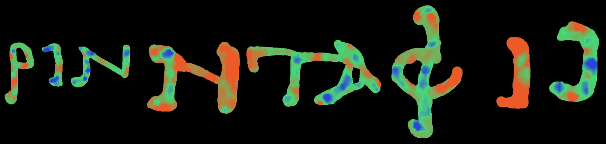
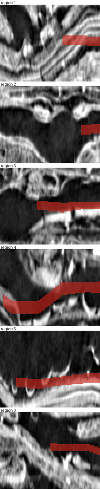

# A measured 3D ink label

**Status:** first artifact, built on `w00_20231016151002` (PHerc. Paris 4 / Scroll 1), RTX 5090, native Windows.
**Code:** [`tools/make_3d_labels.py`](../tools/make_3d_labels.py)
**Measurement it rests on:** [`docs/10_depth_localization.md`](10_depth_localization.md)
**Context:** [villa #192 "Accurate 3d ink labels"](https://github.com/ScrollPrize/villa/issues/192)

## What the annotation actually is

Not a 3D label, and not a 2D label copied down z either. Measured on the
published segment, `<segment>_inklabels.zarr` is `(65, H, W)` with **one
populated z plane** — the middle, z 32 — and 64 empty ones. The supervision mask
is the same. Whatever depth a training run needs, it manufactures:

| mode | what it does with depth |
|---|---|
| `flat` (the tutorial config) | collapses z with a maximum and trains against a 2D target — depth never enters the loss |
| `full_3d` | projects the annotated plane along the surface normal with a **constant** half-thickness, `_DEFAULT_FULL_3D_PROJECTION_HALF_THICKNESS = 1.0` voxel, centered on the fitted surface by construction |

So the thickness and the centering are both assumptions, and #192's request for
real 3D labels is a request to replace them with something measured.

## What this produces

For each annotated pixel, a **band along z**: a center and a half-width, written
as a 3D label on the same grid, chunking and compressor as the existing label
pyramid.

| output | contents |
|---|---|
| `<seg>_inklabels3d.zarr` | the 3D label, OME-Zarr 0.4 pyramid, levels 0–5 (28 MB on disk) |
| `<seg>_inkdepth.zarr` | `center` and `half_width` per pixel, 2D float32, NaN outside the annotation |
| `<seg>_inklabels3d.json` | parameters, per-region medians and spreads, coverage, thickness histogram |
| `<seg>_inklabels3d_qc.png` | one y–z cross section per region: the CT with the band drawn on it |

Measured on the full annotated area — 748 blocks, 22.07M annotated pixels:

| | |
|---|---|
| cells with a measured depth | 5,704 of 6,860 (85.9% of annotated pixels) |
| segment median band | center z **32.5**, half-width **4.0** → 8 voxels thick |
| per-region median center | **29.3 – 40.3** |
| per-region spread of center | 7.5 – 11.2 voxels (std across that region's cells) |
| labeled voxels | 176.7M, mean 8.0 z voxels per annotated pixel |

Against the current default that is a band **8 voxels thick instead of 3**, and
one that moves: region 5 sits at z 40.3 while region 15 sits at 29.3, and inside
a region the surface still moves by several voxels.

The label is always a subset of the annotated column — a pixel the annotator did
not call ink never becomes ink. The tool can only narrow the label in depth,
which keeps the comparison against the current behaviour clean: any difference in
training comes from removing voxels, never from adding area.

## How the depth is estimated, and two ways that failed

Per cell of a 64 px grid, the band center is the centroid of the positive part of
that cell's occlusion profile (how much the ink logit falls when each 4-slice
band is blanked); the half-width is the profile's half-maximum width; the
resulting surface is median-filtered across cells and bilinearly sampled back to
full resolution.

That description is short, but three estimators were needed to get there, and
the QC image is what rejected the first two:

| estimator | within-region spread of the center | verdict |
|---|---|---|
| per pixel, 9 px smoothing | ±12 voxels between neighbouring patches of one stroke | rejected — a papyrus sheet cannot do that |
| per 64 px cell, argmax band | ±17 voxels; two regions 28 voxels apart | rejected — an argmax over 16 small differences follows the noise |
| per 64 px cell, **centroid** | 7.5–11.2 voxels; regions agree with each other and with the aggregate measurement | kept |

A variance-based width (the profile's second moment) was also tried and sat at
the clamp: occlusion sensitivity has long tails, so the second moment measures
the tails rather than the band. The half-maximum width does not have that
problem.



Band center per pixel for six regions, blue shallow → green → red deep over
z 16–40. The first estimator produced hard-edged patchwork here; this one varies
smoothly, with a std of 5–6 voxels inside a letter.



The check that matters, and the one a plan view cannot make: x across, z down,
CT in grey, label band in red. A band that tracks the sheet reads as a ribbon
bending with the layer — which is what these do. The earlier estimators produced
confetti in exactly this view.

## What this does not settle

* **Circularity.** The depth comes from a model trained on the depthless
  annotation. That is why the [model-free measurement](10_depth_localization.md)
  exists — it independently favours z 16–32, agreeing with the band's center —
  and why any training experiment on these labels needs a self-distillation
  control arm before it can claim the labels caused a gain.
* **Nothing upstream consumes it yet.** `flat` trains on a 2D target; `full_3d`
  builds its own by projecting with the constant. Training with this asset needs
  a pipeline change — which is the next step, and the reason the compact
  `center` / `half_width` form is emitted alongside the voxel label.
* **One segment, one checkpoint.** Every number here is `w00_20231016151002` at
  step 20000.
* **Is 8 voxels right?** Unknown. It is what this model's evidence spans, which
  is not the same claim as the ink's physical thickness. The honest framing is
  measurably-better supervision, not ground truth.

## Reproduce

```bash
uv run --project external/villa/ink-detection python tools/make_3d_labels.py \
    data/ink-dataset/phercparis4/w00_20231016151002 \
    external/villa/ink-detection/runs/ink_holdout_20k/ckpt_020000.pth
```

About 13 min on an RTX 5090. `--limit-blocks 12 --dry-run` measures a corner and
writes nothing; `--estimator peak` reproduces the rejected argmax variant. Full
flag list: [`tools/README.md`](../tools/README.md).

---

MIT-licensed.
